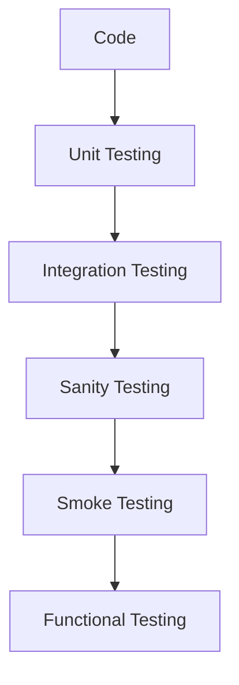

# Design doc template

We want to document everything related to my research and implementation of design docs on different scenarios. Now I'm going to be working more on this after all the other successfull use cases

## How we can integrate the design docs with the testing proccess? 

