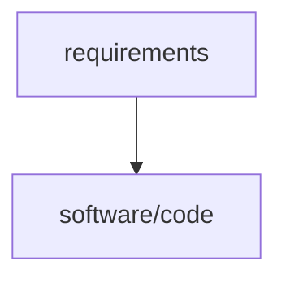
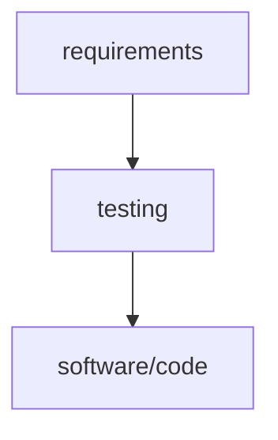
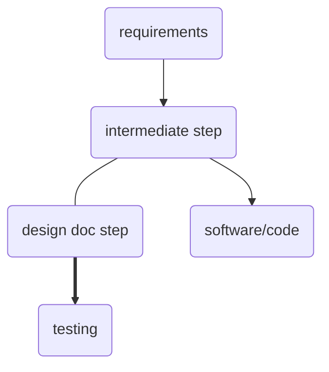

# Design doc Philosophy

## Overview

The design doc it's a technical document that we use to describe the component that we're going to develop and it's intended to be a development tool. It's a document that we use to communicate with the team and with the future developers that are going to work on the component.

## Why philosophy?

We say "Design doc philosophy"? because we want to change the mindset of how we design our software.

## Why we need it?

It's a way to develop software that we can use to improve our development process. It's a way to communicate with the team and with the future developers that are going to work on the component.

## The classic way

We convert the requirements or the user stories into code. Directly following a figma/zeplin design or a document that we receive from the product team. But the way that the solution it's built and maybe some extra explanations are lost in the code. And the future developers that are going to work on the component are going to have a hard time to understand the component.

## The TDD way

We write the tests first and then we write the code. But the tests are not enough to explain the component. And the future developers that are going to work on the component are going to have a hard time to understand the component.

## The design doc way

We write the design doc first and then we write the code. For example before we start building the software we have to write the design doc and explain why we're using a library or why we're using a specific approach. Also put the requirements of the job and with that requirements we're going to have an evidence and a way to test the component. Even if it's manual testing. And in the future if we decide to create a testing suite we're going to have the requirements and the evidence to create the tests. And the future developers that are going to work on the component are going to have a way to understand the component.

