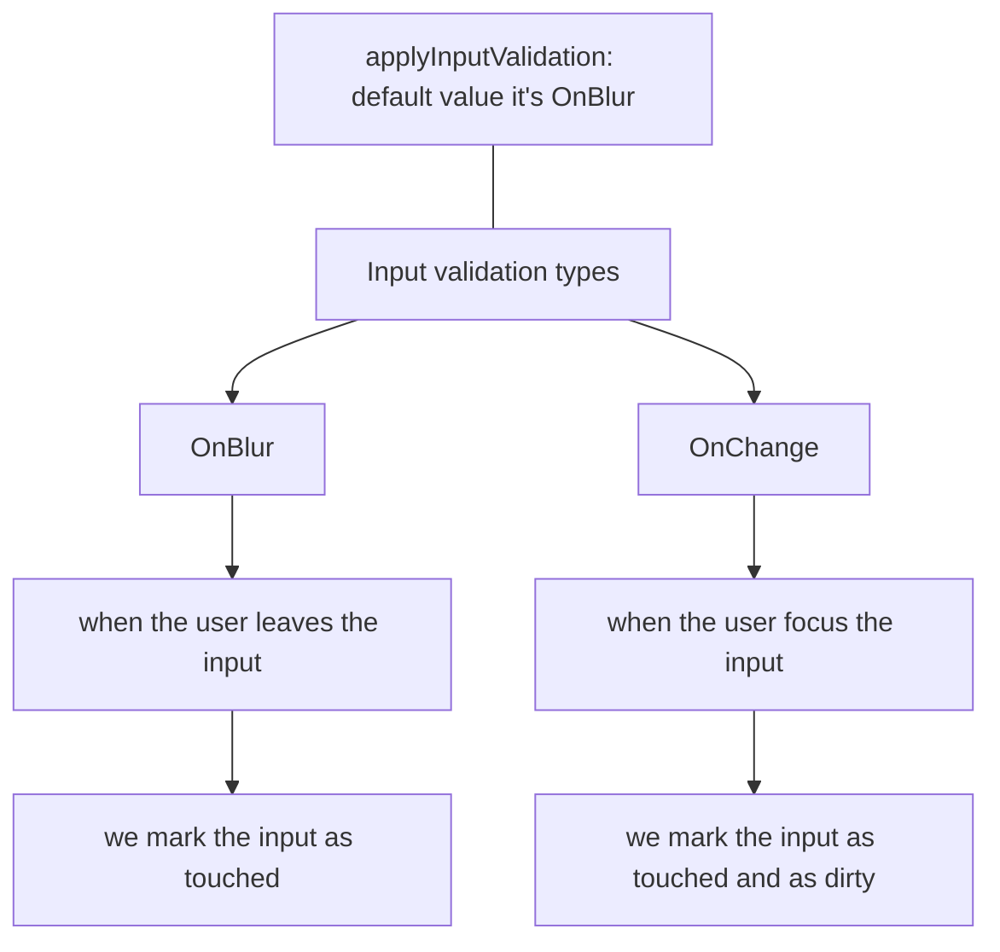

import { Meta, Canvas } from "@storybook/blocks";
import * as InputStories from "./input.stories";
import { Mermaid } from 'mdx-mermaid/Mermaid';

<Meta title="Atoms/Input/Documentation" />

# Input

## Usage


1. Import the module component:

```ts
import { InputModule } from '@library/core-components';
```

2. Add the component in your module:

```ts
@NgModule({
  imports: [InputModule],
})
export class AppModule {}
```

3. Use the component in your template:

```html
<custom-input
  appNumericOnly
  [inputIcon]="dollarIcon?.icon"
  [iconPosition]="dollarIcon?.position"
  [iconColor]="dollarIcon?.iconColor"
  [type]="'text'"
  [inputLabel]="'input label'"
  [formControlName]="formControls.control"
  [isValid]="valid"
>
</custom-input>
```

## Examples

<Canvas of={InputStories.EmptyInput} layout="padded" withToolbar />

<Canvas of={InputStories.DisabledInput} layout="padded" withToolbar />

<Canvas of={InputStories.ReadonlyInput} layout="padded" withToolbar />


<Canvas of={InputStories.InputWithLabel} layout="padded" withToolbar />


### Input with form control

According to the validation types that be can handle. 

OnBlur: when the input leaves the input

OnChange: when the user focus the input we start applying the validations

<Canvas of={InputStories.EmptyInputWithFormControl} layout="padded" withToolbar />

<Mermaid chart={`
flowchart TD
    A["applyInputValidation: default value it's OnBlur"]---B
    B["Input validation types"]-->C["OnBlur"]
    B-->D["OnChange"]
    C-->E["when the user leaves the input"]
    E-->F["we mark the input as touched"]
    D-->G["when the user focus the input"]
    G-->H["we mark the input as touched and as dirty"]
`} />




